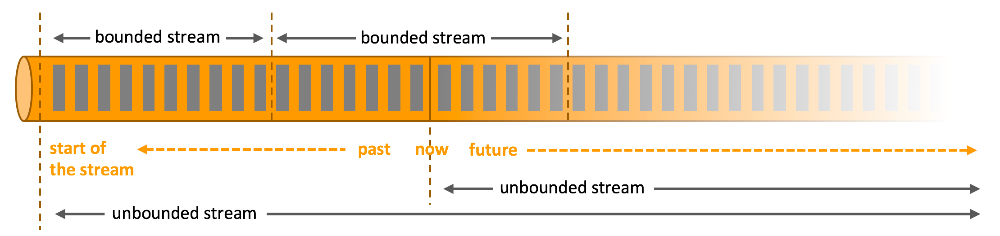
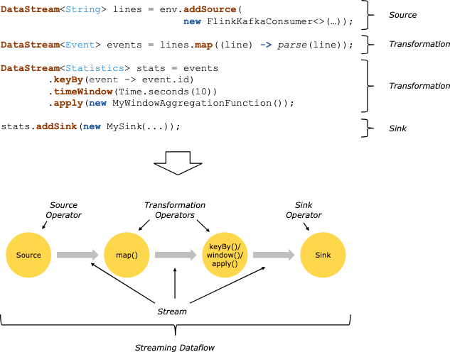

## Description
Reference : https://nightlies.apache.org/flink/flink-docs-master/docs/learn-flink/overview/

### Stream Processing
Data is created as part of a stream - events from web servers, trades from stock exchange, sensor readings from machines
on a factory floor.
When we analyze data - we can organize processing around bounded or unbounded streams, and the choice has profound 
consequences

* Processing a bounded stream -> *batch processing* . 
Ingest entire dataset before producing any results, possible to sort the data, compute global statistics or produce a 
final report that summarizes all the input.

* Processing an unbounded stream -> *Stream Processing*, continuously process data as it arrives
* In flink, applications are composed of **streaming dataflows** that may be transformed by user defined **operators**
* These dataflows form directed graphs that start with **one or more sources**, and end in **one or more sinks**
