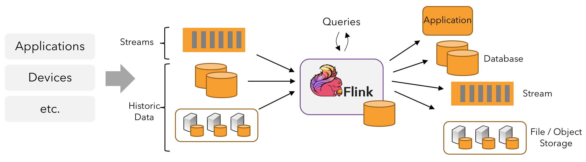
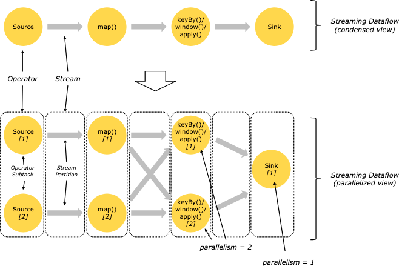
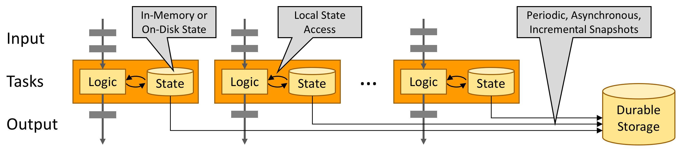

## Description
Reference : https://nightlies.apache.org/flink/flink-docs-master/docs/learn-flink/overview/

### Stream Processing
Data is created as part of a stream - events from web servers, trades from stock exchange, sensor readings from machines
on a factory floor.
When we analyze data - we can organize processing around bounded or unbounded streams, and the choice has profound 
consequences

* Processing a bounded stream -> *batch processing* . 
Ingest entire dataset before producing any results, possible to sort the data, compute global statistics or produce a 
final report that summarizes all the input.

* Processing an unbounded stream -> *Stream Processing*, continuously process data as it arrives
* In flink, applications are composed of **streaming dataflows** that may be transformed by user defined **operators**
* These dataflows form directed graphs that start with **one or more sources**, and end in **one or more sinks**

### Parallel Dataflows
Programs in flink are inherently parallel and distributed.
During execution, 
* a stream has one or more stream partitions 
* each operator has one or more operator subtasks, independent of one another, and execute in different threads
and possibly on different machines/containers

No of operator subtasks => parallelism of that particular operator

Streams can transport data b/w two operators in a one-to-one (forwarding) pattern, or in a redistributing pattern:
* One-to-One Streams :: ex : between Source and map() operators in figure above
Preserve the partitioning and ordering of the elements.
`subtask[1]` of the map() operator will see *same elements* in the *same order* as they were produced by `subtask[1]` 
of the Source operator
* Redistributing Streams :: ex : between map() and keyBy()/window()/apply() in figure above
Change partitioning of streams. Each operator subtask sends data to different target subtasks depending on the selected transformation
  * ex : keyBy() -> repartitions by hashing the key
    * broadcast()
    * rebalance() -> repartitions randomly

### Fault Tolerance via State Snapshots
Flink is able to provide fault-tolerant, exactly once semantics through a combination of state snapshots
and stream replay.
State snapshots -> capture entire state of the distributed pipeline, recording offsets into the input queue as well as
the state throughout the job graph that has resulted from having ingested the data up to that point.
When failure occurs, sources are rewound, state is restored and processing is resumed.