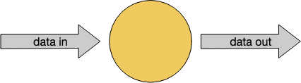
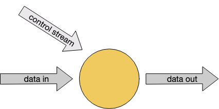

### Data Pipelines & ETL
Reference : https://nightlies.apache.org/flink/flink-docs-release-1.17/docs/learn-flink/etl/
Very Common use case for Flink - implement ETL pipelines that take data from one or more sources,
perform some transformations and/or enrichments, and then store the results somewhere
Note : Flink's Table and SQL APIs are well suited for many ETL Use cases

#### Stateless Transformations
* map()
* flatmap() - map function is suitable *only* when performing a 1:1 transformstion i.e. for each and every stream element coming
in, map() will emit one transformed element.

#### Keyed Streams
* keyBy()
  * often very useful to be able to partition a stream around one of its attributes, so that all events with the same value
  of that attribute are grouped together - sort of a group by operation in SQL
  * `rides.flatMap(new NYCEnrichment()).keyBy(enrichedRide -> enrichedRide.startCell)`
  * every `keyBy` causes a network shuffle that repartitions the stream.
  * In general this is pretty expensive, since it involves network communication along with 
  serialization and deserialization
  * keys can be computed , but they **must be produced in a deterministic way**
  * ex : `keyBy(ride -> GeoUtils.mapToGridCell(ride.startLon, ride.startLat));`

#### Aggregations on Keyed Streams
Usecase : find rides that are the longest rides ever seen(till that point in time) for each startCell 
```
DataStream<Tuple2<Integer, Minutes>> minutesByStartCell = enrichedNYCRides
    .flatMap(new FlatMapFunction<EnrichedRide, Tuple2<Integer, Minutes>>() {

        @Override
        public void flatMap(EnrichedRide ride,
                            Collector<Tuple2<Integer, Minutes>> out) throws Exception {
            if (!ride.isStart) {
                Interval rideInterval = new Interval(ride.startTime, ride.endTime);
                Minutes duration = rideInterval.toDuration().toStandardMinutes();
                out.collect(new Tuple2<>(ride.startCell, duration));
            }
        }
    });
    
// max by duration
minutesByStartCell
  .keyBy(value -> value.f0) // key by start cell
  .maxBy(1) // max by duration
  .print()
```

Note : Above use case requires stateful streaming , flink has to keep track of maximum duration for each distinct key
`maxBy()` is one aggregator function available
`reduce()` is a more general purpose function that you can use to implement your own custom aggregations

### Stateful Transformations
#### Rich Functions
Flink's function interfaces - FilterFunction, MapFunction, FlatMapFunction
These are all examples of the [Single Abstract Method pattern](https://www.tutorialspoint.com/what-are-the-sam-interfaces-in-java#:~:text=An%20interface%20having%20only%20one,available%20by%20default%20is%20allowed.)

For each of these interfaces, Flink also provides a so-called "rich" variant
ex : `RichFlatMapFunction` which has some additional methods, including
* open(Configuration c)
* close()
* getRuntimeContext()

open() is called once, during operator initialization. This is an opportunity to load some static data, or to open a connection
to an external service

getRuntimeContext() is how you can create and access state managed by Flink

* Example with Keyed State
  * Stream of events that you want to de-duplicate, so that you only keep the first event with each key
  * RichFlatMapFunction called Deduplicator
  * ```
    private static class Event {
      public final String key;
      public final long timestamp;
      .
      .
      .
    }
    
    public static void main(String[] args) throws Exception {
      StreamExecutionEnvironment env = StreamExecutionEnvironment.getExecutionEnvironment();
      env.addSource(new EventSource())
        .keyBy(e -> e.key)
        .flatMap(new Deduplicator())
        .print();
      env.execute();
    }
    ```

De-duplicator will need to remember for each key whether there has already been an event for that key.
It will do so using Flink's `keyed state` interface.
When working with a keyed stream, Flink will maintain a K/V store for each item of state being managed

```
public static class Deduplicator extends RichFlatMapFunction<Event, Event> {
  ValueState <Boolean> keyHasBeenSeen;
  
  @Override
  public void open(Configuration conf) {
    ValueStateDescriptor<Boolean> desc = new ValueStateDescriptor<>("keyHasBeenSeen", Types.BOOLEAN);
    keyHasBeenSeen = getRuntimeContext().getState(desc);
  }
  
  public void flatMap(Event event, Collector<Event> out) throws Exception {
    if(keyHasBeenSeen.value()==null){
      out.collect(event);
      keyHasBeenSeen.update(true);
    }
  }
}
```
Deduplicator has two methods : `open()` and `flatmap()`
* `open` method establishes the use of managed state by defining a `ValueStateDescriptor<Boolean>`
  * arguments to the constructor 
    * specify a name for this item of keyed state ("keyHasBeenSeen")
    * and provide information that can be used to serialize these objects (ex : `Types.BOOLEAN`)
* When flatmap method calls `keyHasBeenSeen.value()`, Flink's runtime looks up value of this piece of state 
the key in the context, and according handling as seen above

When deployed to a distributed cluster, there will be many instances of this Deduplicator, each of which will be responsible 
for a disjoint subset of the entire keyspace. Thus, when you see a single item of ValueState, such as 
`ValueState<Boolean> keyHasBeenSeen;`
this represents not just a single Boolean, but rather a distributed, sharded, key/value store.

#### Clearing State
What will happen if the key space is unbounded ? 
* Flink is storing somewhere an instance of Boolean for every distinct key that is used.
* If the set of keys is growing in an unbounded way, its necessary to clear the set of keys that are no longer needed.
`keyHasBeenSeen.clear();`
* Can use Timers to do this , also a State TTL option that can be configurated with the State descriptor that specifies when 
you want the state for stale keys to be automatically cleared.


#### Connected Streams

Instead of pre-defined transformations like above, you may want to dynamically alter some aspects of the transformation
by streaming in thresholds, rules or other params. 

Single operator has two input streams above.
* Connected streams can also be used to implement streaming joins
* Two streams being connected must be keyed in compatible ways.
* Role of keyBy is to partition stream's data, when keyed streams are connected, they must be partitioned in the same way
* This ensures that all the events from both streams with same key are sent to the same instance

```
public static class ControlFunction extends RichCoFlatMapFunction<String, String, String> {
  private ValueState<Boolean> blocked;
  
  @Override
  public void open(Configuration config) {
    blocked = getRuntimeContext().getState(new ValueStateDescriptor<>("blocked", Boolean.class));
  }
  
  @Override
  public void flatMap1(String control_value, Collector<String> out) throws Exception {
    blocked.update(Boolean.TRUE);
  }
  
  @Override
  public void flatMap2(String data_value, Collector<String> out) throws Exception {
    if(blocked.value() == null) {
      out.collect(data_value);
    }
  }
}

public static void main(String[] args) throws Exception {
  StreamExecutionEnvironment env = StreamExecutionEnvironment.getExecutionEnvironment();
  DataStream<String> control = env.fromElements("DROP", "IGNORE").keyBy(x->x);
  DataStream<String> streamOfWords = env.fromElements("Apache", "DROP", "Flink", "IGNORE").keyBy(x->x);
  control.connect(streamOfWords).flatMap(new ControlFunction()).print();
  env.execute();
}
```

* `blocked` Boolean is being used to remember the keys that have been mentioned on the control stream
* and those words are being filtered out of the `streamOfWords` stream
* This `keyed` state is shared between the two streams
* elements from control stream are passed into flatMap1
* elements from streamOfWords stream are passed into flatMap2
* Above is determined by order in which the two streams are connected with `control.connect(streamOfWords)`

NOTE : You have no control over the order in which flatMap1 and flatMap2 callbacks are called. 
These two input streams are racing against each other.

In cases where timing and/or ordering matter, you may find it necessary to buffer events in managed Flink state until 
application is ready to process them.