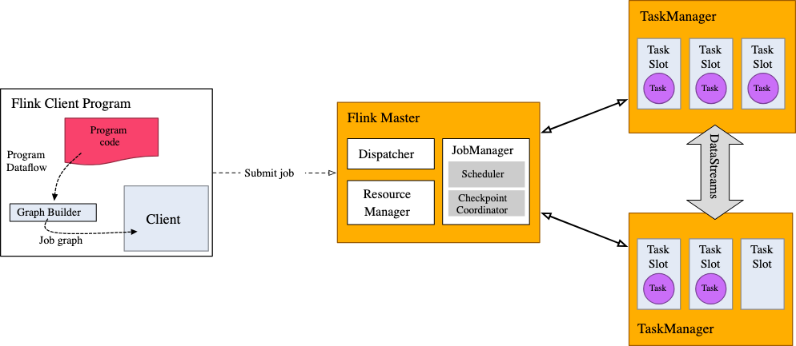

### What can be streamed ?
Flink's datastream APIs let you stream anything they can serialize
Flink's own serializer used for 
* basic types - String, Long, Integer, Boolean, Array
* composite types - POJOs, Tuples, Scala case classes

Flink falls back to Kryo for other types. It is also possible to use other serializers with Flink

#### Java Tuples and POJOs
Flink's native serializer can operate efficiently on tuples and POJOs
* Tuples
For Java, Flink defines its own Tuple0 through Tuple25 types
* POJOs
Flink recognizes a datatype as a POJO type (and allows "by-name" field referencing) if the following conditions are fulfilled
  * Class is public and standalone (no non-static inner class)
  * Class has a public no-arg constructor
  * All non-static, non-transient fields in the class(and all superclasses) are either public (and non-final) or have public getter and setter methods
  that follow Java beans naming conventions for getters and setters

`Refer FlinkNaiveApplication class for reference code`

### Stream Execution Environment
Every flink application needs an execution environment.
Streaming applications need to use a `StreamExecutionEnvironment`

DataStream API calls made in your application build a job graph that is attached to the StreamExecutionEnvironment
When `env.execute()` is called this graph is packaged up and sent to the JobManager, which parallelizes the job and distributes 
slices of it to the Task managers for execution.
Each parallel slice of your job will be executed in a task slot.

**Note** : *Without execute() call , application won't run*

The distributed runtime depends on your application being serializable. It also requires that all dependencies are available
to each node in the cluster.

#### Basic Stream Sources
`FlinkNaviApplication` introduces `streamExecutionEnvironment.fromElements(....)`.
There is also a `fromCollection(Collection)` method on StreamExecutionEnvironment
Other ways - use a socket / or a file (for prototyping mostly)
In real world applications, most commonly used data sources are those that support
low-latency, high throughput parallel reads in combination with rewind and replay - Apache Kafka, Kinesis and various file systems
REST APIs and databases are also frequently used for stream enrichment

#### Basic Stream Sinks
Commonly used Sinks in production include FileSink, various databases and several pub-sub systems
