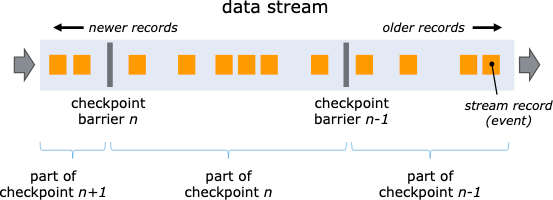
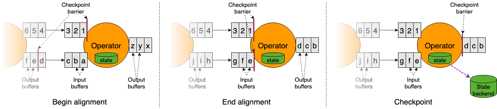

### Fault Tolerance via State Snapshots
#### State Backends
Keyed State managed by Flink is a sort of Sharded K-V store and working copy of each item of keyed state is kept 
somewhere local to the task manager responsible to that key.
Operator state is also local to the machine(s) that need(s) it.

State that Flink manages is stored in a state backend. 
Two implementations available of the state backend -
* Based on RocksDB (EmbeddedRocksDBStateBackend)
  * An Embedded K-V Store that keeps its working state on disk 
  * Snapshotting - Full / Incremental 
  * Supports state larger than available memory
  * 10x slower than heap based backend
* Based on Heap based state backend (HashMapStateBackend)
  * keeps its working state in memory, on the Java Heap
  * Snapshotting - Full
  * Fast, requires large heap
  * Subject to GC

When working with heap based state backend - accesses and updates involve reading and writing 
on the heap. 
For objects kept in EmbeddedRocksDBStateBackend - accesses and updates involve serialization and 
deserialization - more expensive.

#### Checkpoint Storage
Flink periodically takes persistent snapshots of **all the state in every operator** and copies these snapshots
somewhere more durable such as a DFS. In the event of failure, Flink can restore the complete state of your application 
and resume processing as if nothing had gone wrong 

Two implementations of checkpoint storage are available :
* FileSystemCheckpointStorage
  * State backup - Distributed File System
  * Supports very large state size
  * Highly Durable
  * Recommended for production deployments
* JobManagerCheckpointStorage
  * JobManager JVM Heap
  * Good for testing and experimentation with small state locally

### State Snapshots
Definitions :
* Snapshot : refers to the global, consistent image of the state of a flink job.
  * Includes a pointer to each of the data sources (e.g. an offset into the file or Kafka partition)
  * as well as a copy of the state from each of the job's stateful operators that resulted from having
  processed all events up to those positions in the sources
* Checkpoints : Automated snapshots by Flink for the purpose of being able to recover from faults.
  * can be incremental and are optimized for being restored quickly
* Externalized Checkpoint : Flink retains the n-most recent checkpoints (n being configurable) while a job is running,
    and deletes them when a job is cancelled. Can be configured to retain and instead manually resume the job
* Savepoint : Manual snapshot (user triggered) for some operational purpose such as stateful redeploy/upgrade/scaling operation
  * savepoints are always complete and optimized for operational flexibility

#### How does State Snapshotting work ?
-> Asynchronous Barrier Snapshotting (variant of Chandy-Lamport algorithm)

* When a task manager is instructed by the checkpoint coordinator(part of job manager) to begin a checkpoint,
it has all the sources record their offsets and insert numbered checkpoint barriers into their streams
* These barriers flow through the job graph, indicating the part of the stream before and after each checkpoint

* Checkpoint n will contain the state of each operator that resulted from having consumed every event before checkpoint
barrier n, and none of the events after it
* As each operator in the job graph receives one of these barriers, it records its state.
  * Operators with two input streams (such as CoProcessFunction) perform barrier alignment so that snapshot will reflect 
  the state resulting from consuming events from both input streams upto (but not past) both barriers

* Flink's state backends use a copy-on-write mechanism to allow stream processing to continue unimpeded while older
versions of the state are being asynchronously snapshotted.
* Only when snapshots have been durably persisted will these older versions of the state be GCed.

#### Exactly Once Guarantees
When things go wrong in stream processing, possible to have either lost or duplicated results.
With Flink, depending on the choices made in application and cluster you run it on , following possibilities :
* Flink makes no effort to recover from failures (**At most Once**)
* Nothing is lost, but you may experience duplicated results (**At least once**)
* Nothing is lost or duplicated(**Exactly Once**)

NOTE : exactly once does not mean that every event will be processed exactly once, intead it means that every
event will affect the state being managed by Flink exactly one.

Barrier alignment is only needed for providing exactly once guarantees.
If we don't need this, can gain performance by configuring Flink to use CheckpointingMode.AT_LEAST_ONCE,
which disables barrier alignment.

**NOTE**

To Achieve exactly once end-to-end i.e. every event from source affects sinks exactly once, following must be true ::
1. sources must be replayable
2. sinks must be transactional/idempotent