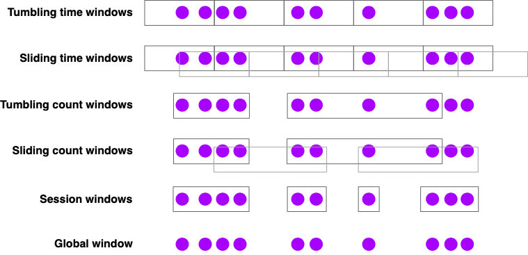

## Streaming Analytics
Reference : https://nightlies.apache.org/flink/flink-docs-release-1.17/docs/learn-flink/streaming_analytics/

### Event Time and Watermarks
Flink supports three different notions of time :
* *event time* : time when event occurred
* *ingestion time* : timestamp recorded by Flink at the moment it ingests the event
* *processing time* : time when specific operator in pipeline is processing the event

For reproducible results, use event time

### Working with Event Time
#### Watermarks
* Why watermarks are needed ?
Say you have a stream of timestamped events that arrive somewhat out of order
.... 23 19 22 24 21 14 17 13 12 15 9 11 7 2 4 -> 

You are trying to create a stream sorter. Process each event from stream as it arrives and emit a new stream containing 
same events, but ordered by their timestamps.

1.) first element sorter sees is 4, but you can't immediately release it as the first element of sorted stream
It may have arrived out of order, and an earlier event might yet arrive (timestamp 2)

-> *Some buffering, and some delay is necessary*

2.) If done wrong, you could end up waiting forever. First sorter saw an event from time 4,
and then an event from time 2. Will event with timestamp less than 2 ever arrive ?
You could wait forever and never see a 1.

-> *Eventually emit 2 as the start of the sorted stream ?*

3.) Some sort of policy is needed that defines when, for any given timestamped event, to stop 
waiting for arrival of earlier events 

-> *That is what watermarks do!*

Event time processing in Flink depends on watermark generators that insert special timestamped elements into the stream,
called *watermarks*.
A watermark for time t is an assertion that the stream is (probably) now complete up through time t.

When should this stream sorter stop waiting, and push out 2 to start the sorted stream ?
-> when a watermark arrives with timestamp of 2 or greater.

4.) You might imagine different policies for deciding how to generate watermarks.
Each event arrives after some delay, and these delays vary, so some events are more delayed than others.
Simple approach -> assume that these delays are bounded by some maximum delay. 
**Bounded-out-of-orderness watermarking**
NOTE : *for most applications a fixed delay works well enough*

#### Latency vs Completeness
Configure watermarking aggressively, with a short bounded delay ?
-> Risk of producing results with rather incomplete knowledge of the input - possibly wrong result, produced quickly

Wait longer and produce results that take advantage of having more complete knowledge of the input streams ?
-> higher latency

* Lateness : defined relative to the watermark. 
  * Watermark(t) asserts that the stream is complete up through time t
  * any event following this watermark whose timestamp is <= t is late.

#### Working with Watermarks
In order to perform event-time based processing, Flink needs to know the time associated with each event, and it also needs 
the stream to include watermarks.

Implement a class that extracts timestamps from the events, and generates watermarks on demand. Easiest way to do this
is by using a WatermarkStrategy

```
DataStream<Event> stream = ...;
WatermarkStrategy<Event> strategy = WatermarkStrategy
    .<Event>forBoundedOutOfOrderness(Duration.ofSeconds(20))
    .withTimestampAssigner((event, timestamp) -> event.timestamp);
    
DataStream<Event> withTimestampsAndWatermarks = 
    stream.assignTimestampsAndWatermarks(strategy);
```

### Windows
Compute aggregate analytics on bounded subsets of the streams in order to answer :
* no of page views per minute 
* no of sessions per user per week
* max temperature per sensor per min

Computing windowed analytics with Flink depends on two principal abstractions 
1. Window Assigners -> assign events to windows (creating new window objects as necessary)
2. Window Functions -> applied to events assigned to a window

Flink's windowing API also has notions of Triggers -> when to call window function
Evictors -> remove elements collected in a window

windowing to a keyed stream
```
  stream.keyBy(<key selector>).window(<window assigner>)
        .reduce | aggregate | process (<window function> )
```

windowing with non keyed stream (processing will not be done in parallel)

```
  stream.windowAll(<window assigner>)
        .reduce | aggregate | process (<window function>)
```

#### Window Assigners


Broad spectrum two kinds of window assigners - time-based and count-based.
Time-based window assigners come in both event time and processing time flavors.

* When working with count-based windows, these windows will not fire until a batch is complete. There is
no option to time-out and process a partial window. **Can implement that behaviour with custom Trigger**

Global window assigner assigns every event (with the same key) to the same global window.
Only useful if you are going to do own custom windowing, with a custom Trigger.

#### Window Functions
Three basic options for processing contents of your window
* as a batch, using a *ProcessWindowFunction* that will be passed an Iterable with the window's contents
* incrementally, with a ReduceFunction or an AggregateFunction that is called as each event is assigned to the window
* combination of the two, pre-aggregated results of a ReduceFunction or AggregateFunction are supplied to ProcessWindowFunction
when the window is triggered.

ProcessWindowFunction Example
```
DataStream<SensorReading> input = ...;
input.keyBy(x -> x.key).window(TumblingEventTimeWindows.of(Time.minutes(1)))
     .process(new MyWastefulMax());
     
 public static class MyWastefulMax extends ProcessWindowFunction<
    SensorReading,  // input type
    Tuple3<String, Long, Integer>, //output type
    String, //key type
    TimeWindow> { // window type
      
      @Override
      public void process(
        String key,
        Context context,
        Iterable<SensorReading> events,
        Collector<Tuple3<String, Long, Integer>> out
      ) {
        int max = 0;
        for(SensorReading reading : events) {
          max = Math.max(max, event.value);
        }
        out.collect(Tuple3.of(key, context.window().getEnd(), max));
      }
    }
```
Things to note in above implementation
* All events assigned to the window have to be buffered in keyed Flink state until window is triggered. **Expensive**
* ProcessWindowFunction is passed a Context object which contains information about the window 
  * windowState and globalState 
  * places where you can store per-key, per-window or global per-key information for all windows of that key

* Incremental Aggregation Example
```
DataStream<SensorReading> input = ...;
input
  .keyBy(x -> x.key)
  .window(TumblingEventTimeWindows.of(Time.minutes(1)))
  .reduce(new MyReducingMax(), new MyWindowFunction());
  
private static class MyReducingMax implements ReduceFunction<SensorReading> {
  public SensorReading reduce(SensorReading r1, SensorReading r2) {
    return r1.value() > r2.value() ? r1 : r2;
  }
}

private static class MyWindowFunction extends ProcessWindowFunction<
  SensorReading, Tuple3<String, Long, SensorReading>, String, TimeWindow> {
  
  @Override
  public void process(
    String key,
    Context context,
    Iterable<SensorReading> maxReading,
    Collector<Tuple3<String, Long, SensorReading>> out
   ) {
   SensorReading max = maxReading.iterator().next();
   out.collect(Tuple3.of(key, context.window().getEnd(), max));
  }  
}
```
NOTE : Iterable<SensorReading> will contain exactly one reading - pre-aggregated maximum computed by MyReducingMax

#### Late Events
By default, when using event time windows, late events are dropped.

You can arrange for events that would be dropped to be collected to an alternate output stream instead, using a mechanism
called Side Outputs.

```
OutputTag<Event> lateTag = new OutputTag<Event> ("late") {};
SingleOutputStreamOperator<Event> result = stream.keyBy(...)
  .window(...)
  .sideOutputLateData(lateTag)
  .process(...);
DataStream<Event> lateStream = result.getSideOutput(lateTag);
```

Can also specify an interval of allowed lateness during which late events will continue to be assigned to the appropriate 
window(s) (whose state will have been retained).
By default each late event will cause window function to be called again

Default allowed lateness - 0. elements behind watermark are dropped or sent to the side output

```
  stream.keyBy(...)
    .window(...)
    .allowedLateness(Time.seconds(10))
    .process(...);
```
