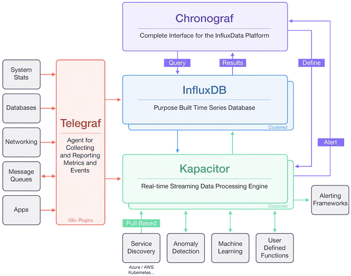

## Description 
TICK Stack - designed for handling time series data, well suited for storing, querying, visualizing
and alerting on time-series metrics and events data

Credit for above diagram : https://betterprogramming.pub/the-tick-stack-as-a-docker-application-package-1d0d6b869211

## Components 

### Telegraf
* Data collection agent of TICK stack
* Responsible for gathering and collecting time series data from various sources such as system metrics,
application metrics, log files, etc
* Telegraf supports a wide range of input plugins that allow to collect data from various systems/services

### InfluxDB
* TS-DB that stores data collected from telegraf/other data sources
* Optimized for high write and query performance
* Ideal for handling large volumes of TSD
* InfluxDB organizes data into databases and measurements (similar to tables in traditional databases), with each measurement having multiple tags and fields.

### Chronograf
* Visualization and UI of TICK stack
* Allows to explore, query and visualize data stored in InfluxDB
* Similar to Grafana 

### Kapacitor
* Real time Streaming data processing engine in TICK stack
* provides capabilities for creating and managing alerts, processing continuous queries,
performing stream processing on incoming data.
